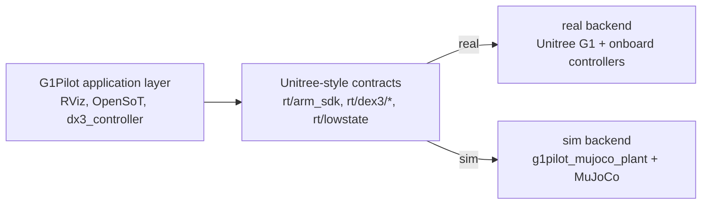
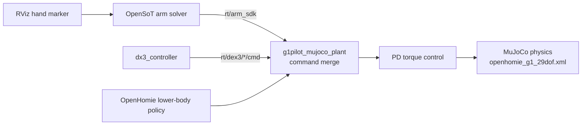
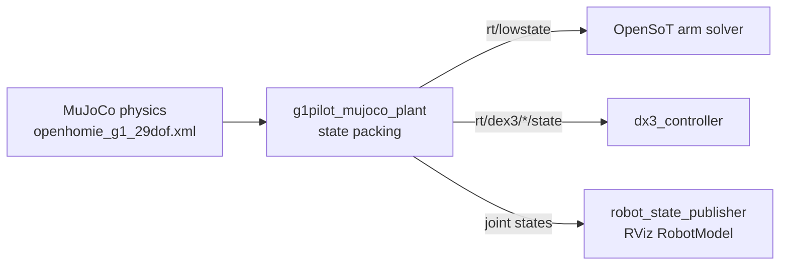

# G1Pilot

## Fork-Specific Addition: MuJoCo Simulation Backend

The main architectural change in this fork is a backend swap. The G1Pilot
application layer stays the same; only the robot backend changes:
`source scripts/source_g1.sh real <interface>` targets the real G1, while
`source scripts/source_g1.sh sim` targets MuJoCo.



The simulator keeps the same application interfaces as the robot path: OpenSoT
still publishes arm intent on `rt/arm_sdk`, Dex3 commands still use
`rt/dex3/{left,right}/cmd`, and robot state is still published through Unitree
DDS-style state topics.

Detailed sim command path:



Detailed sim state path:



The important ownership rule is that `g1pilot_mujoco_plant` owns the simulated
robot backend. It loads the MuJoCo XML, runs the OpenHomie standing policy,
merges arm/Dex3 intent, computes actuator torques, steps physics, and publishes
simulated state.

Demo videos:

- [MuJoCo RViz arm-control demo](https://github.com/sri299792458/g1pilot/releases/download/mujoco-demo-media-2026-07-01/g1pilot-mujoco-rviz-arm-demo.mp4)
- [MuJoCo Dex3 open/close demo](https://github.com/sri299792458/g1pilot/releases/download/mujoco-demo-media-2026-07-01/g1pilot-mujoco-dex3-open-close-demo.mp4)

### Run MuJoCo + RViz

Download the generated reachability map once. It is hosted as a release asset
because it is too large to keep in normal Git history:

```bash
cd /path/to/g1pilot
mkdir -p config/reachability
curl -L \
  -o config/reachability/g1_29dof_lock_waist_reachability.npz \
  https://github.com/sri299792458/g1pilot/releases/download/mujoco-demo-media-2026-07-01/g1_29dof_lock_waist_reachability.npz
```

Terminal 1 starts the G1Pilot application layer:

```bash
cd /path/to/g1pilot
source scripts/source_g1.sh sim

ros2 launch g1pilot mujoco_openhomie_manipulation.launch.py \
  hand_model:=dex3
```

Terminal 2 starts the MuJoCo plant:

```bash
cd /path/to/g1pilot
source scripts/source_g1.sh sim

ros2 run g1pilot g1pilot_mujoco_plant
```

The plant currently loads
`description_files/xml/openhomie_g1_29dof.xml`, which is the generated
OpenHomie/Unitree-interface MuJoCo model with Dex3 hands. The `hand_model`
launch argument selects the ROS/RViz/controller hand path; it does not switch
the physical MuJoCo XML.

For a quick headless stability check:

```bash
cd /path/to/g1pilot
source scripts/source_g1.sh sim

ros2 run g1pilot g1pilot_mujoco_plant -- --headless --duration 8
```

Dex3 smoke commands:

```bash
source scripts/source_g1.sh sim
ros2 topic pub --once /g1pilot/dx3/left/command std_msgs/msg/String '{data: close}'
ros2 topic pub --once /g1pilot/dx3/left/command std_msgs/msg/String '{data: open}'
```

For RViz arm markers, enable the global arm gate and then enable each marker
from its RViz context menu:

```bash
source scripts/source_g1.sh sim
ros2 topic pub --once /g1pilot/arms/enabled std_msgs/msg/Bool '{data: true}'
```

[](
https://opensource.org/licenses/BSD-3-Clause)
[](
https://docs.ros.org/en/jazzy/index.html)
[](https://github.com/Hucebot/g1pilot/stargazers)


G1Pilot is an open‑source ROS 2 package for Unitree G1 humanoid robots. Basically is made to leave the robot lower body to the controller of unitree while providing all necessary tools to control the upper body and teleoperate the robot. It exposes two complementary control Joint (low‑level, per‑joint) and Cartesian (end‑effector) and continuously publishes core robot state for monitoring and visualization in RViz.

## Highlights

- Dual controller: Unitree’s built‑in loco controller for walking + custom upper‑body controller for arm manipulation.

- Dual control modes: switch between Joint and Cartesian control on the fly.

- Always‑on telemetry: IMU, odometry, and per‑motor feedback (temperature, voltage, position, velocity).

- RViz‑ready: packaged URDF + RViz config for immediate visualization of the real robot.

- Docker‑first workflow: reproducible build/run scripts for Ubuntu 22.04 + ROS 2 Humble.

- Extensible: clear node boundaries and parameters make it easy to add behaviors or swap planners.

- Navigation stack integrated: MOLA odometry and path planner for autonomous navigation.

## G1Pilot Flow


## G1Pilot Features


| **Joint Controller** | **Cartesian Controller** |
|---------------------|--------------------|
|  |  |
| **Path Planner & Odometry** | **Control Interface** |
|  |   |

## Table of Contents
- [Fork-Specific Addition: MuJoCo Simulation Backend](#fork-specific-addition-mujoco-simulation-backend)
- [Pre-requisites](#pre-requisites)
- [Quick Start](#quick-start)
- [Nodes Overview](#-nodes-overview)
- [Usage](#usage)
- [Contributing](#contributing)
- [License](#license)

## Pre-requisites
- Be connected to the robot via Ethernet. **It's important to know which interface you are using.**

## Quick Start
### Docker (recommended)
We prepare two docker images to build and run the package. One is for building in the teleoperation station, and the other is for running in the robot. Both images
are located in the `docker` folder. You can build and run the images with the provided scripts.
To build the docker image in the laptop, run the following command:
  ```bash
  sh build.sh
  ```

To build the docker image in the robot, run the following command:
  ```bash
  sh build_camera.sh
  ```

Then, you can run the docker image in the laptop with the following command:
  ```bash
  sh run.sh
  ```

To run the docker image in the robot with the following command:
  ```bash
  sh run_camera.sh
  ```

## 🧠 Nodes Overview

- **robot_state**: Publishes the state of the robot, including joint positions, velocities, and efforts and custom message to visualize the temperature and voltage of each motor.
- **interactive_marker**: Provides an interactive marker in RViz to control the end-effector position and orientation in Cartesian space.
- **dx3_controller**: Node to control the DEX3 Unitree hand, allowing to open and close the hand using ROS2 commands.
- **joystick**: Node to teleoperate the robot using a joystick, mapping joystick inputs to robot commands.
- **joy_mux**: Multiplexer for joystick inputs, allowing to switch between different control modes, specifcally made to provide autonomous navigation and teleoperation using the same joystick.
- **loco_client**: Client node to communicate with the Unitree loco controller, providing high-level commands for walking and balancing and low-level commands for joint control and cartesian control.
- **dijkstra_planner**: Custom path planner using Dijkstra's algorithm to compute optimal paths for the robot to follow in a given environment with a look ahead distance parameter to smooth the path and improve navigation performance.
- **nav2point**: Node to integrate the planner with the navigation stack, converting navigation goals into waypoints for the robot to follow.
- **create_map**: Dummy node to create a 2D occupancy grid map from the robot's sensors, used for navigation and obstacle avoidance. 
- **mola_fixed**: Node to interface with the MOLA odometry system, transform the odometry data into g1 frame.
- **arm_controller**: Node to control the upper body of the robot, providing joint and cartesian control modes for the arms.
- **ui_interface**: Node to provide a user interface to control the main functionalities of the robot.
## Usage

### Configuration File
The configuration file is located in the `config` folder. You can modify the parameters according to your needs. It's important to set up all the correct information for your robot.

### Instructions
Once you have the docker image running, you can run the following command to start the unitree node: For this we implement a custom build command to build the packages inside the docker.
If you want to build all the packages, you can run the following command:
```bash
./cbuild 
```
If you want to build only the g1pilot package, you can run the following command:
```bash
./cbuild g1pilot
```

Then, source the workspace:

```bash
source install/setup.bash
```

Also if you are connected to the robot, you need to source the way to connecto the robot, for example:

```bash
source setup_uri.sh <interface>
``` 

You can launch the bringup robot with the following command:

```bash
ros2 launch g1pilot bringup_launcher.launch.py
```

Or you can run each node separately according to your needs.

1.- To run the Livox LiDAR, you can run the following command:

```bash
ros2 launch g1pilot livox_launcher.launch.py
```

2.- To run the mola odometry, you can run the following command:

```bash
ros2 launch g1pilot mola_launcher.launch.py
```

3.- To run the navigation stack and enable the locomotion of the robot, you can run the following command:

```bash
ros2 launch g1pilot navigation_launcher.launch.py
```

4.- To run the manipulation stack, you can run the following command:

```bash
ros2 launch g1pilot manipulation_launcher.launch.py
```

5.- To run the teleoperation stack, you can run the following command:

```bash
ros2 launch g1pilot teleoperation_launcher.launch.py
```

For more details on how to use the package, please refer to the [instructions](docs/INSTRUCTIONS.md) document. Also you can check the [cheats](docs/CHEATS.md) document for quick commands and tips to use the package.

## Contributing
We welcome contributions to **G1Pilot**! If you have suggestions, improvements, or bug fixes, please follow these steps:

1. Fork the repository.
2. Create a new branch for your feature or bug fix.
3. Make your changes and commit them with clear messages.
4. Submit a pull request detailing your changes.


## Maintainer
This package is maintained by:

**Clemente Donoso**  
Email: [clemente.donoso@inria.fr](mailto:clemente.donoso@inria.fr)
GitHub: [CDonosoK](https://github.com/CDonosoK)  

## License
BSD‑3‑Clause. See [LICENSE](LICENSE) for details.
